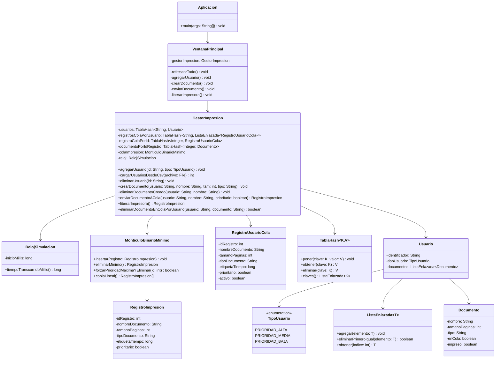

# Diagrama de clases (Mermaid)

```mermaid
classDiagram
    class Aplicacion {
        +main(args: String[]) void
    }

    class VentanaPrincipal {
        -gestorImpresion: GestorImpresion
        -refrescarTodo() void
        -agregarUsuario() void
        -crearDocumento() void
        -enviarDocumento() void
        -liberarImpresora() void
    }

    class GestorImpresion {
        -usuarios: TablaHash~String, Usuario~
        -registrosColaPorUsuario: TablaHash~String, ListaEnlazada~RegistroUsuarioCola~~
        -registroColaPorId: TablaHash~Integer, RegistroUsuarioCola~
        -documentoPorIdRegistro: TablaHash~Integer, Documento~
        -colaImpresion: MonticuloBinarioMinimo
        -reloj: RelojSimulacion
        +agregarUsuario(id: String, tipo: TipoUsuario) void
        +cargarUsuariosDesdeCsv(archivo: File) int
        +eliminarUsuario(id: String) void
        +crearDocumento(usuario: String, nombre: String, tam: int, tipo: String) void
        +eliminarDocumentoCreado(usuario: String, nombre: String) void
        +enviarDocumentoACola(usuario: String, nombre: String, prioritario: boolean) RegistroImpresion
        +liberarImpresora() RegistroImpresion
        +eliminarDocumentoEnColaPorUsuario(usuario: String, documento: String) boolean
    }

    class RelojSimulacion {
        -inicioMillis: long
        +tiempoTranscurridoMillis() long
    }

    class Usuario {
        -identificador: String
        -tipoUsuario: TipoUsuario
        -documentos: ListaEnlazada~Documento~
    }

    class Documento {
        -nombre: String
        -tamanoPaginas: int
        -tipo: String
        -enCola: boolean
        -impreso: boolean
    }

    class RegistroImpresion {
        -idRegistro: int
        -nombreDocumento: String
        -tamanoPaginas: int
        -tipoDocumento: String
        -etiquetaTiempo: long
        -prioritario: boolean
    }

    class RegistroUsuarioCola {
        -idRegistro: int
        -nombreDocumento: String
        -tamanoPaginas: int
        -tipoDocumento: String
        -etiquetaTiempo: long
        -prioritario: boolean
        -activo: boolean
    }

    class TipoUsuario {
        <<enumeration>>
        PRIORIDAD_ALTA
        PRIORIDAD_MEDIA
        PRIORIDAD_BAJA
    }

    class ListaEnlazada~T~ {
        +agregar(elemento: T) void
        +eliminarPrimeroIgual(elemento: T) boolean
        +obtener(indice: int) T
    }

    class TablaHash~K,V~ {
        +poner(clave: K, valor: V) void
        +obtener(clave: K) V
        +eliminar(clave: K) V
        +claves() ListaEnlazada~K~
    }

    class MonticuloBinarioMinimo {
        +insertar(registro: RegistroImpresion) void
        +eliminarMinimo() RegistroImpresion
        +forzarPrioridadMaximaYEliminar(id: int) boolean
        +copiaLineal() RegistroImpresion[]
    }

    Aplicacion --> VentanaPrincipal
    VentanaPrincipal --> GestorImpresion
    GestorImpresion --> RelojSimulacion
    GestorImpresion --> MonticuloBinarioMinimo
    GestorImpresion --> TablaHash
    GestorImpresion --> Usuario
    GestorImpresion --> RegistroUsuarioCola
    Usuario --> TipoUsuario
    Usuario --> ListaEnlazada
    Usuario --> Documento
    MonticuloBinarioMinimo --> RegistroImpresion
```
